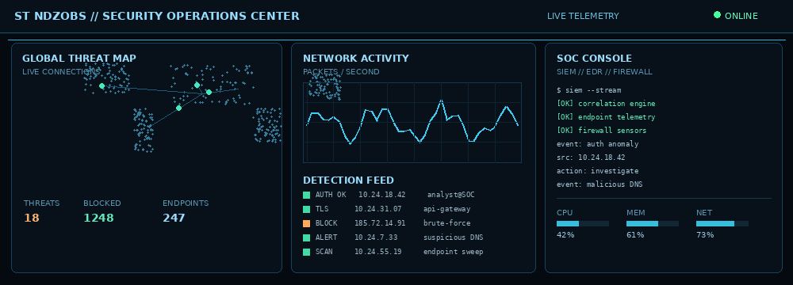
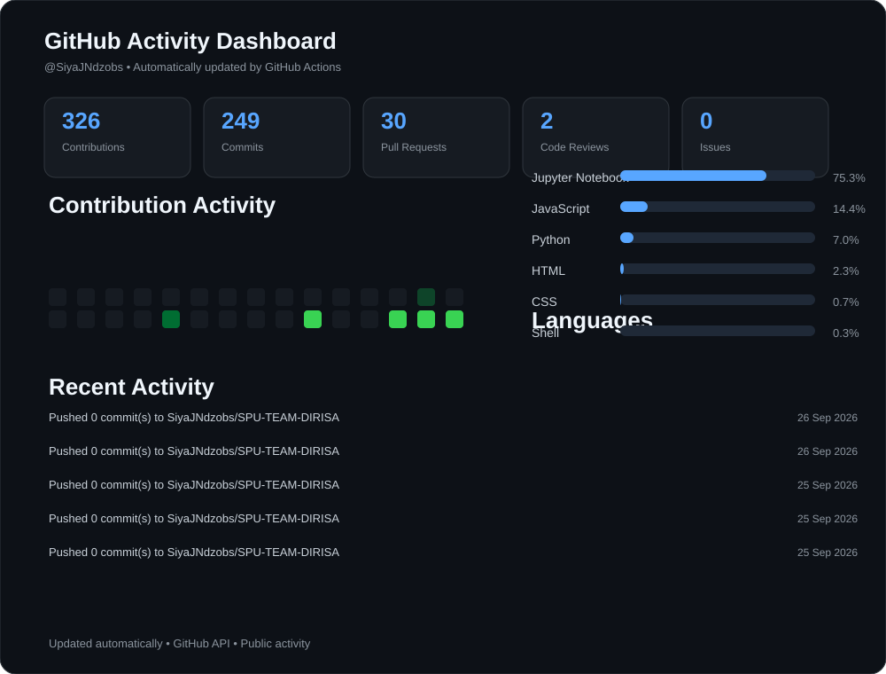

#  Hi, I'm Siyabonga José Ndzobondzobo (SiyaB)

 Location: South Africa |  Open to Learn | Open to Work

ICT Final-Year Student | Becoming a Full-Stack AI Developer | Experienced in building end-to-end digital solutions from concept to functional prototypes, apps, web apps and websites with secure data practices and a solid Software Development Life Cycle | Self-Led Cybersecurity Learner | Cisco Networking Instructor

  <strong> LinkedIn:</strong>
  <a href="http://www.linkedin.com/in/siyabonga-josé-ndzobondzobo-16bba119">
    www.linkedin.com/in/siyabonga-josé-ndzobondzobo-16bba119
  </a>
  &nbsp; | &nbsp;
  <strong> Discord:</strong> <code>mazaza01</code>
  &nbsp; | &nbsp;
  <strong> WhatsApp:</strong> <code>+27672598417</code>

---

<!-- ==================== SOC HERO ==================== -->

  

  
  
  
  

  👁️ <strong>Profile Views</strong>

---

# Projects
<table>
<tr>
<th>Project</th>
<th>Description</th>
</tr>

<tr>
<td><strong>E-RANK</strong></td>
<td>
A taxi-rank management platform developed as an annual <strong>Project Management</strong> project during my 3rd year. The system digitizes taxi-rank operations, allowing taxi owners to track revenue while marshals manage passenger and trip information to improve safety, accountability, and tracking of losses. Built with React + FastAPI.
  
<a href="https://erank.onrender.com"><strong>View the deployed project →</strong></a>
</td>
</tr>

<tr>
<td><strong>🛡️ ITWEB Secure Innovation Hackathon 2026 — Neutral Fence</strong></td>
<td>
A cybersecurity innovation prototype developed by <strong>Team Neutral Fence</strong> for the ITWEB Secure Innovation Hackathon 2026. The <strong>Sentinel Grid</strong> concept demonstrates how multiple security layers and nested honeypots can protect municipal billing systems by isolating real billing data while simulating a successful attack environment for attackers.
  
<a href="https://heckerthon.netlify.app/"><strong>View the deployed project →</strong></a>
</td>
</tr>

</table>

---

#  Cybersecurity Focus

I'm building practical knowledge in cybersecurity, network security, SOC environments, threat detection, defensive security, vulnerability awareness, secure system design, honeypots and Blue Team practices.

---

#  Activity Overview

<table>
<tr>

<td width="25%" valign="top">

###  Currently Working On

Cybersecurity journey, especially **Penetration Testing & SOC**; developing secure apps, web apps and websites; becoming a strong **Full-Stack AI Developer**.

</td>

<td width="25%" valign="top">

###  Currently Learning

ICT applications, Full-Stack Development, AI, Cybersecurity, Penetration Testing, SOC & related areas.

</td>

<td width="25%" valign="top">

###  Looking to Collaborate On

**Full-Stack, Backend, Frontend & AI Developers**

</td>

<td width="25%" valign="top">

###  Looking for Help With

**Cybersecurity learning & practical guidance** — looking for a cybersecurity coach/mentor.

Contact details are provided above.

</td>

</tr>
</table>

---

#  Current Interests

<table>
<tr>
<th> Cybersecurity</th>
<th> Software Development</th>
<th> Networking & Infrastructure</th>
<th> Emerging Technology</th>
</tr>

<tr>
<td valign="top">

Security Operations 
Network Security 
Threat Detection 
Incident Response 
Blue Team 
Penetration Testing 
Secure Systems 
Vulnerability Awareness

</td>

<td valign="top">

Full-Stack Development 
AI Applications Development 
Web Application Development 
Application Development 
Website Development 
Database Management 
Software Development Life Cycle 
Testing & Quality Assurance 
Systems Thinking & Analysis 
Data Analysis & Visualization

</td>

<td valign="top">

Computer Networking 
Cisco Networking 
Network Configuration 
Network Security 
Infrastructure Fundamentals 
Troubleshooting

</td>

<td valign="top">

Internet of Things (IoT) 
Artificial Intelligence 
Automation 
Technology Integration

</td>

</tr>
</table>

---

<!-- ==================== GITHUB ACTIVITY DASHBOARD ==================== -->

  

<strong> Expand to see my GitHub activity</strong>

 

<!-- ==================== END GITHUB ACTIVITY DASHBOARD ==================== -->
